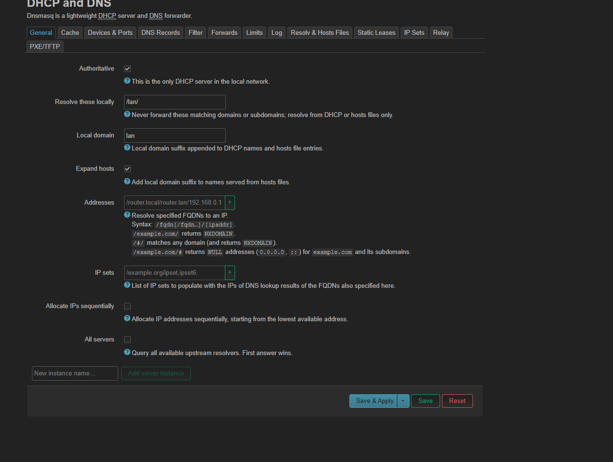

# Basic OpenWRT Setup

This document covers the initial setup for OpenWRT, including basic configurations like changing the admin password, subnet settings (with a personal preference for different subnet ranges), and DNS changes for the LAN (after LANCache is set up).

## Steps:

1. **Access the Router Interface**
   - Open a web browser and go to `http://192.168.1.1` (or the IP assigned to your OpenWRT router).
   - Log in with the default credentials (usually `root` for username and `admin` for password).

2. **Change Admin Password**
   - Go to **System** > **Administration**.
   - Change the password from the default (`admin`) to something more secure.
   - **Note:** This is an important step to secure your router.

3. **Change Subnet (Optional)**  
   *(If you prefer a different subnet than the default `192.168.1.x`, feel free to adjust the following)*  
   - Go to **Network** > **Interfaces**.
   - Modify the LAN interface subnet, for example, change it to `192.168.2.0/24` or another subnet of your choice.

4. **Check Critical Settings**  
   Make sure the following settings are configured as required:
   
   - This includes verifying the settings shown in the image to ensure your router is configured correctly before moving forward.

5. **Change LAN DNS to LANCache (After LANCache Setup)**
   - Once your **LANCache server** is up and running, navigate to **Network** > **Interfaces** > **LAN**.
   - Set the DNS server to the IP address of your LANCache server.
   - **Important:** Only change this DNS setting once LANCache is properly configured to avoid DNS issues.

---

### Notes:
- This setup assumes you’re using default OpenWRT settings and only require minor customization. If you plan to make more advanced configurations or have a specific network environment, refer to OpenWRT’s [documentation](https://openwrt.org/docs/start).
